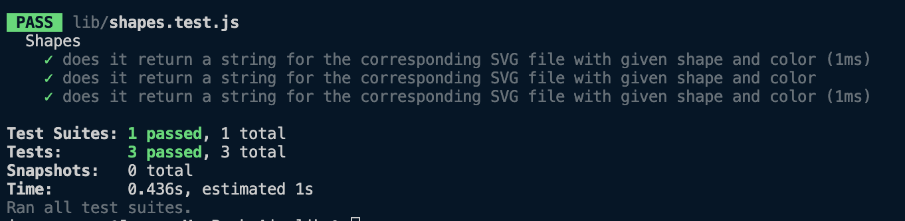

# SVG-LOGO-MAKER

  ## Table of Contents
- [Description](#description) 
- [Installation](#installation)
- [Usage](#usage)
- [Contributing](#contributing)
- [Test](#test)
- [Contact](#contact)
 

  ## Description

  The purpose of this project is to create an SVG file with prompts asking for a shape, the shape's color, typing text and choosing a text color.  Test must be performed using jest and it must pass.

  

  
  
  ## Installation

  To install, clone Github repository and install on local machine.

  ## Usage

  For usage, node.js must be installed, along with the iquirer npm package and jest.

  ## Contributing
  Jorge Guzman

  ## Test
  Various test were ran using the command npm run test using Jest.
  
  ## Contact
  Email: jguzman913@gmail.com

  Github: https://github.com/JGuzman87/